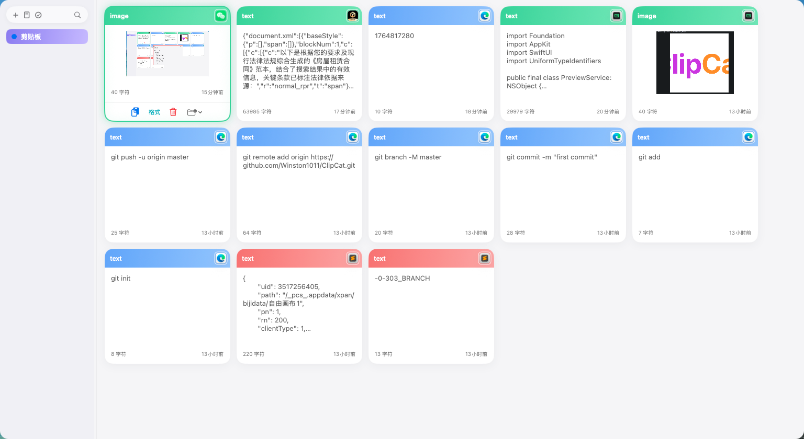
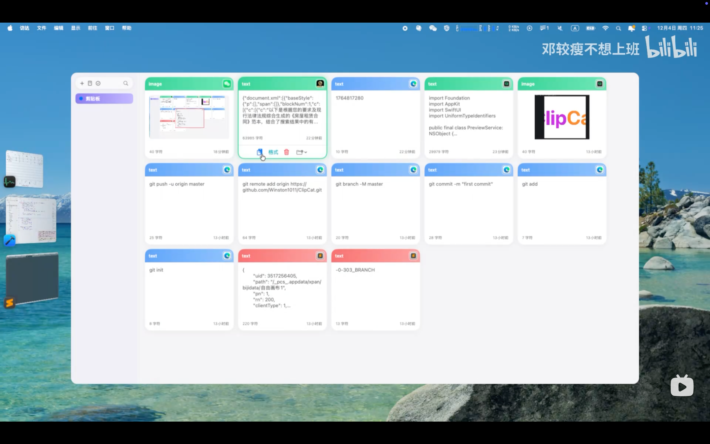

# ClipCat（macOS）

轻量、好看的 macOS 剪贴板管理器：采集历史、时间线浏览、收藏分组、直接粘贴、快速粘贴、即时搜索等能力，帮助你更快地跨应用粘贴内容。

## 功能特性
- 历史采集：自动捕获文本、链接、图片、文件、颜色等类型
- 时间线浏览：横向列表、纵向列表、网格三种布局，可快速预览与重命名
- 收藏分组：Pinboards 创建/重命名/颜色标记，历史与收藏独立
- 直接粘贴：双击快速复制，写入系统剪贴板，支持纯文本粘贴
- 搜索与过滤：关键词 + 类型/来源应用过滤，输入即搜
- 设置与快捷键：历史保留周期、布局切换、快捷键映射、面板位置调节
- 快速预览：支持JSON格式化、代码块等预览，支持时间戳直接转换预览

## 按键
- 面板：`⇧+⌘+P`（可设置修改）
- 直接粘贴：双击或回车键
- 快速预览：空格键
- 移动：方向键
- 搜索：任意键
- 多选：`Shift` 或 `Command` 键 + 鼠标点击

## 界面预览

查看演示视频(mp4)：👇
[](https://www.bilibili.com/video/BV1Ve2YBwExp/)

## 安装指南
1. 从 [Releases](https://github.com/Winston1011/ClipCat/releases/) 下载最新版本的`.dmg`。
2. 打开下载的文件，将 `ClipCat.app` 拖入 `Applications` 文件夹。
3. 首次安装时，需要开启允许已知开发者的应用。
   - 打开“系统偏好设置” → “安全性与隐私” → “安全”
   - 点击“已知开发者”，确认允许 `ClipCat` 安装。
4. 从“应用程序”文件夹启动 `ClipCat`。


### TIPS
- 如果打开是"xxx.app 已损坏，无法打开，你应该将它移到废纸篓/打不开 xxx，因为它来自身份不明的开发者解决方法"，请在Mac终端执行以下命令：
```bash
sudo xattr -rd com.apple.quarantine /Applications/ClipCat.app
```

参考：
- [打开损坏解决方案](https://www.macwk.com/article/12)
